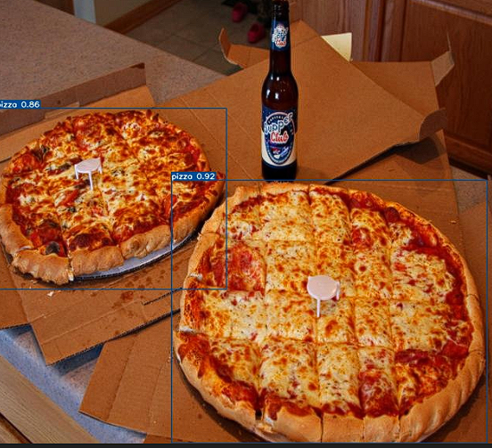
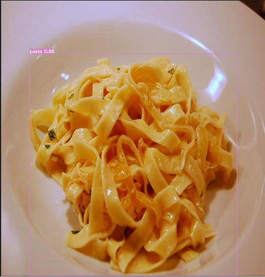

## YOLOv7 Usage

This project aims to recognize food items using the YOLOv7 model. Follow the steps below to use the model:

1. **Navigate to YOLOv7 Directory**: Go to the YOLOv7 main directory in your terminal or command prompt. For example:

   ```bash
   cd yolov7-main
   ```

2. **Run the Model**: Use the following command to run the model:

   ```bash
   python detect.py --weights best.pt --conf 0.5 --img-size 640 --source test/24.jpg --view-img --no-trace
   ```

   This command will use the pretrained model weights named `best.pt`, set the minimum confidence threshold to `%50`, set the input image size to `640x640`, and process an image named `24.jpg` in the test directory. It will display the processed image and disable trace mode.

3. **Test Images**: Test images to be used are located in the `image` folder. You should specify the path and name of the image file using the `--source` parameter.

![image][(images_for_readme/image.png)


